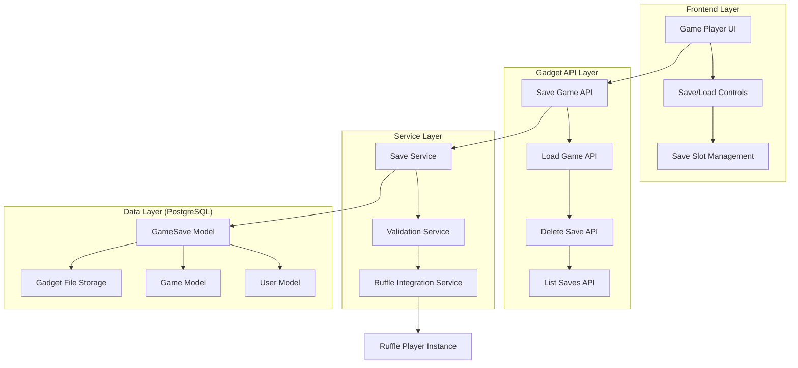
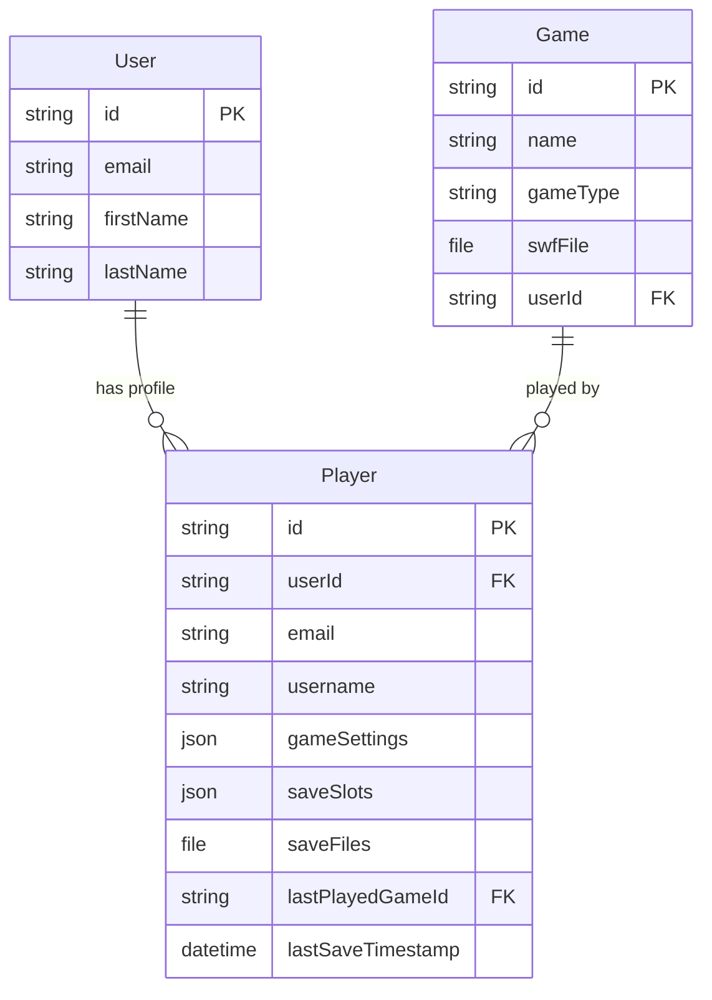

# Game Save System Design Document

## Overview

The game save system will provide persistent storage for flash game states, allowing users to save and restore their progress across sessions. The system integrates with the existing Gadget framework, leveraging the current user authentication system and extending the data model to support save file management. The design focuses on seamless integration with Ruffle-core's save state capabilities while maintaining security and data integrity.

## Architecture

### High-Level Architecture



### Data Flow

1. **Game Selection Flow**: User views game browser → Sees games with New/Continue options → Sees save file browser → Selects action → Navigates to game player
2. **Save Operation**: User triggers save → Frontend captures Ruffle state → API validates and stores → Database persistence
3. **Load Operation**: User selects save (from browser or in-game) → API retrieves save data → Frontend restores Ruffle state → Game resumes
4. **Management Operations**: User manages save slots → API handles CRUD operations → UI reflects changes

## Components and Interfaces

### Game Browser Interface Design

The main game selection interface will be restructured to provide a comprehensive save management experience:

**Layout Structure**:

```
┌─────────────────────────────────────────────────────────────┐
│                     Game Library                            │
├─────────────────────────────────────────────────────────────┤
│  Games Column                │  Save Files Column           │
│  ┌─────────────────────────┐ │  ┌─────────────────────────┐ │
│  │ Game Title              │ │  │ Swords & Sandals 2      │ │
│  │ [New Game] [Continue]   │ │  │ ├ Save 1 (2 hours ago)  │ │
│  │ Last played: 2h ago     │ │  │ ├ Save 3 (1 day ago)    │ │
│  └─────────────────────────┘ │  │ └ Auto-save (5 min ago) │ │
│  ┌─────────────────────────┐ │  │                         │ │
│  │ Another Game            │ │  │ Another Game            │ │
│  │ [New Game] [Continue]   │ │  │ ├ Save 1 (3 days ago)   │ │
│  │ Never played            │ │  │ └ Save 2 (1 week ago)   │ │
│  └─────────────────────────┘ │  └─────────────────────────┘ │
└─────────────────────────────────────────────────────────────┘
```

**Behavior**:

- **New Game**: Starts fresh game session
- **Continue**: Loads most recent save for that game (disabled if no saves exist)
- **Save Files Column**: Shows all saves grouped by game, sorted by last saved timestamp
- **Click on specific save**: Loads that exact save file

### 1. Extended Player Model (Using Existing Model)

**Purpose**: Extend existing Player model to store game save data with metadata

**Additional Fields to Add**:

```typescript
// Add these fields to existing Player model schema
saveSlots: {
  type: "json",
  // Structure: { [gameId]: { [slotNumber]: { metadata, timestamp, description } } }
},
saveFiles: {
  type: "file",
  allowMultiple: true,
  allowPublicAccess: false
  // Store actual save data files
},
lastPlayedGame: {
  type: "belongsTo",
  parent: { model: "game" }
},
lastSaveTimestamp: {
  type: "dateTime",
  includeTime: true
}
```

**Key Features**:

- Leverages existing Player model with user relationship
- JSON structure for flexible save slot management
- Multiple file storage for save data
- Maintains existing gameSettings functionality

### 2. Save Management Service

**Purpose**: Handle save/load operations with Ruffle integration

**Interface**:

```typescript
interface SaveService {
  // Core save operations
  saveGame(
    userId: string,
    gameId: string,
    slotNumber: number,
    options?: SaveOptions
  ): Promise<GameSave>;
  loadGame(
    userId: string,
    gameId: string,
    slotNumber: number
  ): Promise<SaveData>;
  deleteGame(userId: string, gameId: string, slotNumber: number): Promise<void>;

  // Save management
  listSaves(userId: string, gameId: string): Promise<GameSave[]>;
  getSaveMetadata(
    userId: string,
    gameId: string,
    slotNumber: number
  ): Promise<SaveMetadata>;

  // Auto-save functionality
  enableAutoSave(
    userId: string,
    gameId: string,
    interval: number
  ): Promise<void>;
  disableAutoSave(userId: string, gameId: string): Promise<void>;
}

interface SaveOptions {
  description?: string;
  metadata?: Record<string, any>;
  overwrite?: boolean;
}

interface SaveData {
  data: Uint8Array;
  metadata: SaveMetadata;
}

interface SaveMetadata {
  timestamp: Date;
  gameVersion?: string;
  playerLevel?: number;
  gameTime?: number;
  screenshot?: string;
  customData?: Record<string, any>;
}
```

### 3. Ruffle Integration Service

**Purpose**: Interface with Ruffle-core for state management

**Interface**:

```typescript
interface RuffleIntegrationService {
  // State capture and restoration
  captureGameState(player: RufflePlayer): Promise<Uint8Array>;
  restoreGameState(player: RufflePlayer, saveData: Uint8Array): Promise<void>;

  // Game information extraction
  extractGameMetadata(player: RufflePlayer): Promise<GameMetadata>;
  captureScreenshot(player: RufflePlayer): Promise<string>;

  // Validation
  validateSaveData(saveData: Uint8Array, gameId: string): Promise<boolean>;
  isGameSaveSupported(player: RufflePlayer): Promise<boolean>;
}

interface GameMetadata {
  currentLevel?: number;
  playerStats?: Record<string, any>;
  gameTime?: number;
  version?: string;
}
```

### 4. Frontend Components

**Game Selection Interface**

**Purpose**: Main game browser with new game/continue options and save file management

**Interface**:

```typescript
interface GameBrowserProps {
  games: Game[];
  userSaves: GameSave[];
  onNewGame: (gameId: string) => void;
  onContinueGame: (gameId: string, saveId?: string) => void;
  onLoadSpecificSave: (saveId: string) => void;
  onDeleteSave: (saveId: string) => void;
}

interface GameCardProps {
  game: Game;
  mostRecentSave?: GameSave;
  onNewGame: () => void;
  onContinue: () => void;
}

interface SaveFileBrowserProps {
  saves: GameSave[];
  groupedByGame: Record<string, GameSave[]>;
  onLoadSave: (saveId: string) => void;
  onDeleteSave: (saveId: string) => void;
}
```

**In-Game Save Controls**

**Purpose**: UI components for save/load functionality during gameplay

**Interface**:

```typescript
interface SaveControlsProps {
  gameId: string;
  rufflePlayer: RufflePlayer;
  onSaveComplete?: (save: GameSave) => void;
  onLoadComplete?: (save: GameSave) => void;
  onError?: (error: Error) => void;
}

interface SaveSlotManagerProps {
  gameId: string;
  saves: GameSave[];
  onSave: (slotNumber: number, options?: SaveOptions) => Promise<void>;
  onLoad: (slotNumber: number) => Promise<void>;
  onDelete: (slotNumber: number) => Promise<void>;
}
```

### 5. API Endpoints

**Game Browser Endpoints**

- `GET /api/games/with-saves` - Get all games with most recent save info
- Response: `{ games: Game[], saves: GameSave[], mostRecentSaves: Record<string, GameSave> }`

**User Save Management**

- `GET /api/users/saves` - Get all saves for current user, grouped by game
- Response: `{ saves: GameSave[], groupedByGame: Record<string, GameSave[]> }`

**Save Game Operations**

- `POST /api/games/:gameId/saves` - Create new save
- Body: `{ slotNumber: number, description?: string, saveData: File }`
- Response: `GameSave`

**Load Game Operations**

- `GET /api/games/:gameId/saves/:slotNumber` - Load specific save slot
- `GET /api/games/:gameId/saves/recent` - Load most recent save
- `GET /api/saves/:saveId` - Load save by ID
- Response: `{ saveData: Uint8Array, metadata: SaveMetadata }`

**Save Management**

- `GET /api/games/:gameId/saves` - List saves for specific game
- `DELETE /api/games/:gameId/saves/:slotNumber` - Delete save slot
- `DELETE /api/saves/:saveId` - Delete save by ID
- Response: `{ success: boolean }`

## Data Models

### Extended Entity Relationships (Using Existing Models)



### Save Data Structure

The save data will be stored as binary files with the following structure:

```typescript
interface SaveFileStructure {
  header: {
    version: string;
    gameId: string;
    timestamp: number;
    checksum: string;
  };
  ruffleState: Uint8Array; // Raw Ruffle save state
  gameMetadata: {
    level?: number;
    score?: number;
    playerStats?: Record<string, any>;
    customData?: Record<string, any>;
  };
}
```

## Error Handling

### Error Categories

1. **Validation Errors**

   - Invalid slot numbers (1-10)
   - Unauthorized access attempts
   - Corrupted save data
   - Unsupported game types

2. **Ruffle Integration Errors**

   - Save state capture failures
   - State restoration failures
   - Incompatible save data
   - Player instance not ready

3. **Storage Errors**

   - File upload failures
   - Database connection issues
   - Insufficient storage space
   - File corruption

4. **Network Errors**
   - API request timeouts
   - Connection failures
   - Rate limiting

### Error Handling Strategy

```typescript
interface ErrorHandler {
  handleSaveError(error: SaveError): Promise<void>;
  handleLoadError(error: LoadError): Promise<void>;
  handleValidationError(error: ValidationError): Promise<void>;

  // Recovery strategies
  attemptRetry(operation: () => Promise<any>, maxRetries: number): Promise<any>;
  fallbackToLocalStorage(saveData: SaveData): Promise<void>;
  notifyUser(message: string, type: "error" | "warning" | "info"): void;
}
```

### Graceful Degradation

- If Ruffle save states are not supported, disable save functionality with clear messaging
- If network is unavailable, queue save operations for later retry
- If storage quota is exceeded, prompt user to delete old saves
- If save data is corrupted, offer to start new game with notification

## Testing Strategy

### Unit Tests

1. **Save Service Tests**

   - Save data validation
   - Slot number constraints
   - User authorization
   - File storage operations

2. **Ruffle Integration Tests**

   - State capture functionality
   - State restoration accuracy
   - Metadata extraction
   - Error handling

3. **API Endpoint Tests**
   - Request/response validation
   - Authentication checks
   - Error responses
   - Rate limiting

### Integration Tests

1. **End-to-End Save/Load Flow**

   - Complete save operation from UI to database
   - Load operation restoring exact game state
   - Save slot management operations
   - Cross-browser compatibility

2. **Ruffle Player Integration**
   - Save state capture during gameplay
   - State restoration at various game points
   - Multiple save slots per game
   - Auto-save functionality

### Performance Tests

1. **Save Data Size Limits**

   - Large save file handling
   - Compression effectiveness
   - Upload/download speeds

2. **Concurrent Operations**
   - Multiple users saving simultaneously
   - Rapid save/load operations
   - Database performance under load

### Security Tests

1. **Access Control**

   - User can only access own saves
   - Proper authentication validation
   - File access permissions

2. **Data Integrity**
   - Save data corruption detection
   - Checksum validation
   - Malicious file upload prevention

## Implementation Phases

### Phase 1: Core Infrastructure

- GameSave model creation
- Basic API endpoints
- Save service implementation
- Database migrations

### Phase 2: Ruffle Integration

- State capture/restore functionality
- Metadata extraction
- Error handling for Ruffle operations
- Save data validation

### Phase 3: Frontend Implementation

- Game browser interface with New/Continue options
- Save file browser with game grouping and sorting
- In-game save/load UI components
- Save slot management interface
- Integration with existing game player
- User feedback and notifications

### Phase 4: Advanced Features

- Auto-save functionality
- Save data compression
- Screenshot capture
- Performance optimizations

### Phase 5: Testing and Polish

- Comprehensive testing suite
- Error handling refinement
- Performance optimization
- Documentation completion
